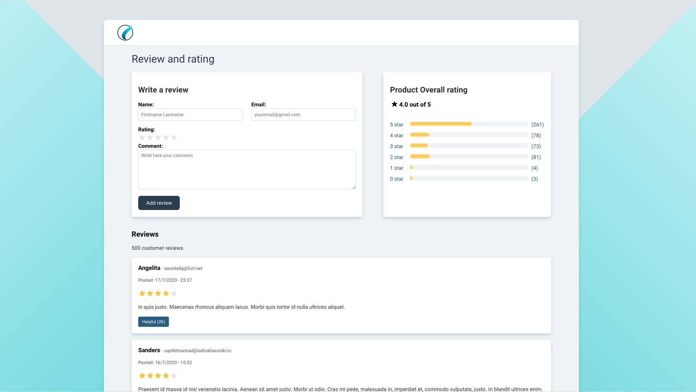

# Product Review App

A product review app which displays a graph with the current tendencies. Additionally, it shows a list of reviews from other users and it allows the possibility to add new review through a form.

The technologies used to develop this project are:

* ReactJS
* TypeScript
* Redux Toolkit
* Styled Components

**Live Demo:** [Here](http://esjavascript.com/)

## Prerequisites

Before you continue, ensure you have met the following requirements:

* You have installed the latest version of [Docker](https://www.docker.com/get-started).
* You have a basic understanding of the terminal and command lines.

## Running the app locally in DEV mode
In order to run the application, this repository should be cloned on a local computer. Opening the computer terminal, the following command needs to be run from the app root folder:

`docker build -t cherino_webapp:dev .`

This command will build the development image. Please, keep in mind that this is only required once.

Then, spin up the container once the build is done:

`docker run --name review_app -it --rm -v ${PWD}:/app -v /app/node_modules -p 3000:3000 -e CHOKIDAR_USEPOLLING=true cherino_webapp:dev`

Navigate to http://localhost:3000/ in your browser to view the app.

If you run into an <em>"ENOENT: no such file or directory, open '/app/package.json"</em> error, you may need to add an additional volume: `-v /app/package.json`.

To stop the Docker container run:

`docker stop review_app`

To run the [scripts](#scripts) within the container:

`docker exec -it review_app <command>`

## Running the app in PRODUCTION mode

To build the image in production mode:

`docker build -f Dockerfile.prod -t cherino_webapp:prod`

Then, spin up the container:

`docker run --name review_app_prod -it --rm -p 1337:80 cherino_webapp:prod`

Navigate to http://localhost:1337/ in your browser to view the app.

To stop the production container:

`docker stop review_app_prod`

# Technical details

This project was bootstrapped with [Create React App](https://github.com/facebook/create-react-app).

## Available Scripts

In the project directory, you can run:

### `yarn start`

Runs the app in the development mode. 
Open [http://localhost:3000](http://localhost:3000) to view it in the browser.

The page will reload if you make edits. 
You will also see any lint errors in the console.

### `yarn test`

Launches the test runner in the interactive watch mode. 
See the section about [running tests](https://facebook.github.io/create-react-app/docs/running-tests) for more information.

### `yarn build`

Builds the app for production to the `build` folder. 
It correctly bundles React in production mode and optimizes the build for the best performance.

The build is minified and the filenames include the hashes. 
Your app is ready to be deployed!

See the section about [deployment](https://facebook.github.io/create-react-app/docs/deployment) for more information.

### `yarn eject`

**Note: this is a one-way operation. Once you `eject`, you can’t go back!**

If you aren’t satisfied with the build tool and configuration choices, you can `eject` at any time. This command will remove the single build dependency from your project.

Instead, it will copy all the configuration files and the transitive dependencies (webpack, Babel, ESLint, etc) right into your project so you have full control over them. All of the commands except `eject` will still work, but they will point to the copied scripts so you can tweak them. At this point you’re on your own.

You don’t have to ever use `eject`. The curated feature set is suitable for small and middle deployments, and you shouldn’t feel obligated to use this feature. However we understand that this tool wouldn’t be useful if you couldn’t customize it when you are ready for it.

## Learn More

You can learn more in the [Create React App documentation](https://facebook.github.io/create-react-app/docs/getting-started).

To learn React, check out the [React documentation](https://reactjs.org/).

